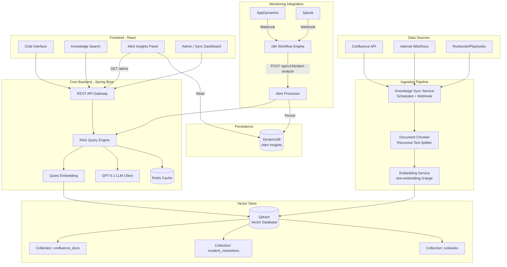
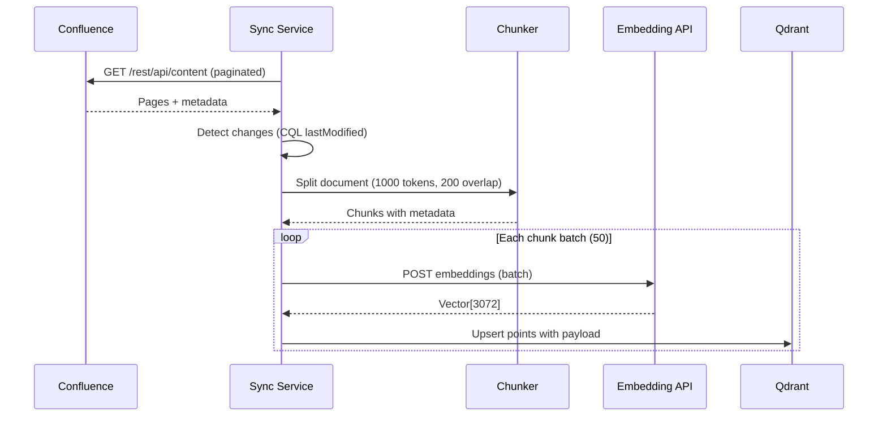
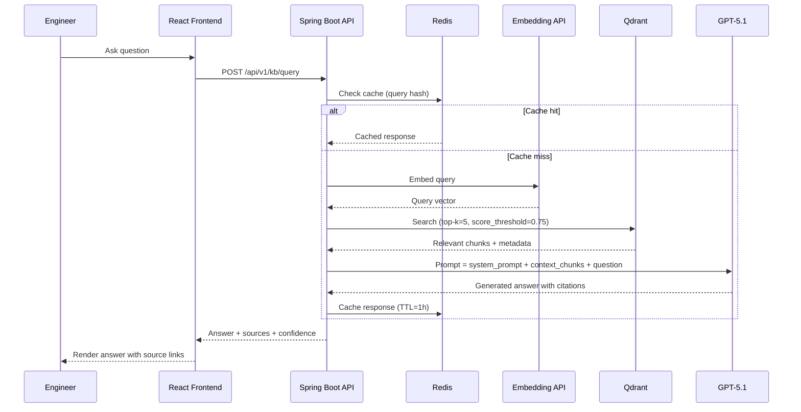
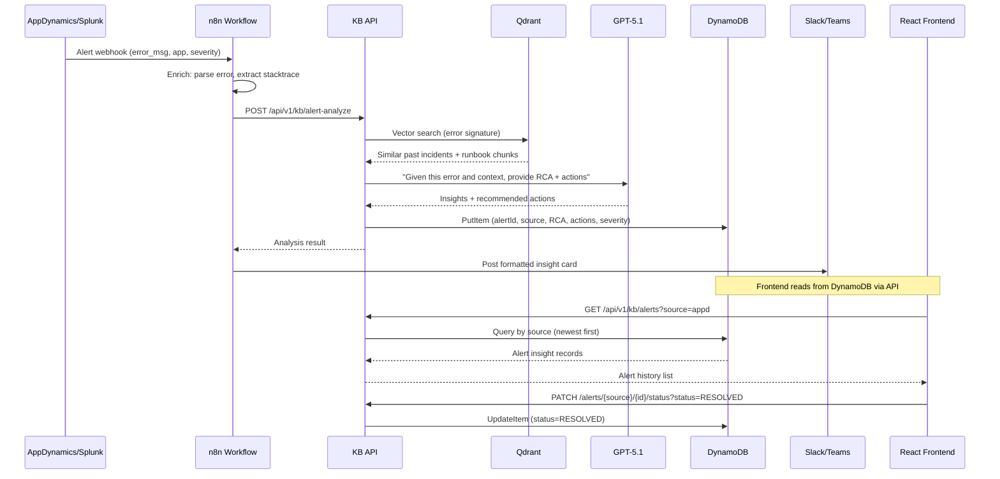
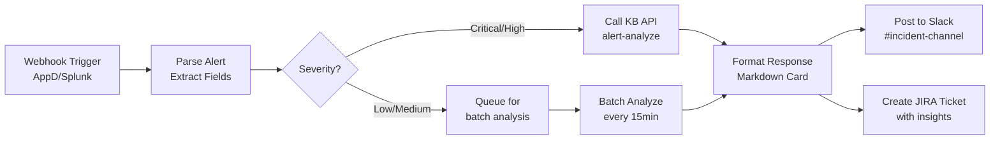

# Knowledge Base Platform - Architecture Design

## Overview

RAG (Retrieval-Augmented Generation) knowledge base platform that ingests knowledge from Confluence and other sources into Qdrant vector database, provides intelligent Q&A for engineers, and integrates with AppDynamics/Splunk monitoring to deliver automated incident insights.

## Architecture Diagram

## Data Flow: Knowledge Ingestion

## Data Flow: Q&A Query (RAG)

## Data Flow: Monitoring Alert Analysis (n8n + DynamoDB)

## n8n Workflow Design

## Component Details

### Qdrant Collections Schema

| Collection | Vector Dim | Payload Fields | Distance |
|---|---|---|---|
| `confluence_docs` | 3072 | page_id, space_key, title, url, last_updated, chunk_index | Cosine |
| `incident_resolutions` | 3072 | incident_id, error_type, app_name, resolution, resolved_date | Cosine |
| `runbooks` | 3072 | runbook_id, title, category, steps, owner_team | Cosine |

### Tech Stack

| Layer | Technology |
|---|---|
| Frontend | React 18 + TypeScript + Ant Design |
| Backend | Java 21 + Spring Boot 3.2 |
| Vector DB | Qdrant (self-hosted or cloud) |
| LLM | GPT-5.1 (OpenAI API) |
| Embedding | text-embedding-3-large (3072 dim) |
| Cache | Redis |
| Workflow | n8n (self-hosted) |
| Monitoring Sources | AppDynamics, Splunk |
| Notifications | Slack / Microsoft Teams |

### API Endpoints

| Method | Path | Description |
|---|---|---|
| POST | `/api/v1/kb/query` | Ask a question, get RAG answer |
| POST | `/api/v1/kb/alert-analyze` | Analyze alert, persist to DynamoDB |
| GET | `/api/v1/kb/alerts` | List alert insights from DynamoDB (filter by source/severity) |
| GET | `/api/v1/kb/alerts/{source}/{alertId}` | Get single alert detail |
| PATCH | `/api/v1/kb/alerts/{source}/{alertId}/status` | Update alert status (ACK/RESOLVED) |
| POST | `/api/v1/kb/ingest/confluence` | Trigger Confluence sync |
| GET | `/api/v1/kb/search` | Semantic search without LLM generation |
| GET | `/api/v1/kb/sources` | List ingested sources |
| GET | `/api/v1/kb/sync-status` | Check ingestion pipeline status |
| DELETE | `/api/v1/kb/collection/{name}` | Clear a collection |
